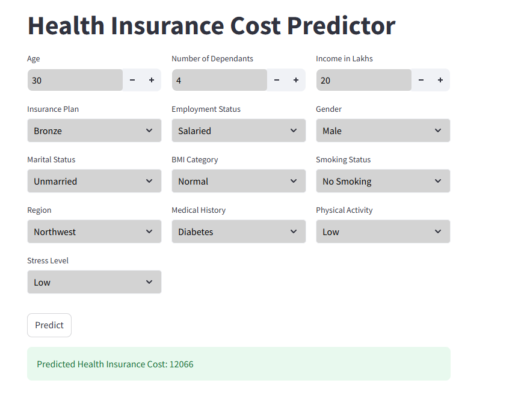

# 💰 Insurance Premium Predictor

A **Streamlit web app** that predicts the **insurance premium** based on user inputs such as:

- Age
- Existing medical conditions
- Number of dependents
- Employment status
- Income level
- Smoking habits
- and more...

The prediction is powered by an **XGBoost** machine learning model trained on historical insurance data.

---

## 🧠 About the Project

This project aims to help users estimate their **insurance premium** by entering basic personal and lifestyle information. It can be used by:

- Individuals exploring insurance options
- Insurance agents estimating client premiums
- Developers building insurance-related platforms

The backend ML model is built using **XGBoost**, known for its performance and accuracy on structured/tabular data.

---

## 🚀 Features

- 📊 Predicts insurance premiums in real time
- 📋 Takes multiple input parameters
- 🧠 Trained using XGBoost regression model
- 🧼 Built-in data preprocessing
- 🌐 Deployed with Streamlit for an interactive user interface

---

## 📥 Parameters Used

The app takes the following inputs:

- `Age`
- `Gender`
- `Number of Dependents`
- `Annual Income`
- `Employment Type`
- `Pre-existing Conditions` (e.g., Diabetes, Heart disease)
- `Smoking Status`
- Any other relevant features you have in your dataset

---

## 📸 Demo




---

## 🛠️ Tech Stack

- **Frontend**: Streamlit
- **Backend**: Python
- **ML Model**: XGBoost Regressor
- **Libraries**: pandas, scikit-learn, xgboost, streamlit

---


### Set-up & Execution

1. Run the following command to install all dependencies. 

    ```bash
    pip install -r requirements.txt
    ```

1. Run the streamlit app by running the following command.

    ```bash
    streamlit run ./main.py
    ```
